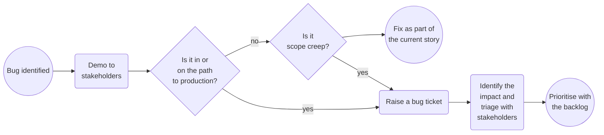

It is important that everyone in the team has a shared understanding of how they work together, however having the right level of documentation is tricky, especially around ways of working. Not enough will cause team members to not understand principles, boundaries or constraints which could impact mental health, and too much will overload team members, running the risk of key pieces of information being overlooked. Finding a balance is important and is an ongoing task and requires continual care.

<!--more-->

Over time a project and a team's ways of working will evolve, having an up to date set of documents on the team's ways of working will maintain alignment even when the team shape inevitably changes. These should be living documents, we should be open to criticism and challenge, refining our documentation and processes.

Starting a new project can be a daunting task. The goal of this article is to provide a sensible starting point to align your team(s), outlining ceremonies that I find useful and documents that I would expect to see. I am clearly a fan of documentation, however I try to keep important documents lean. I want the team to be able to digest them quickly and be easy to refer back to.

## Ceremonies

### Standup

### Refinement

### 3 amigos

### Sprint planning

### Kickoff

### Desk check

## Definitions

### Definition of Ready

Getting halfway through a story only to find key pieces of information are missing or have not been signed off by the organisation is frustrating. It slows down the team and hurts morale. Knowing when a story is ready for development is incredibly important. A short and simple tick list to move a story from analysis to ready for dev should ensure we only work on what is most important and ready for development.

* Follows the story/ bug/ spike template
* Refined with BA
* Estimated
* Prioritised
* Not blocked/ No dependencies

### Definition of Done

Without a clear definition of done, how do we know the feature or story is complete? Our definition of done relies heavily on well written clear stories. Depending on your path to production and QA process this can vary. Unless otherwise stated the following should be completed before we can say the story is complete.

* All acceptance criteria completed
* All acceptance criteria covered by automated tests
* All acceptance criteria tested by someone who did not develop the story
* Desk checked with story stakeholders
* Ready for showcase
* Deployed to production
* Feature toggle enabled
* Appropriate documentation

## Templates

### Story

The story should encompass all information needed. Aiming for thin vertical sliced stories that can deliver value into the users hands, allowing us to get feedback quickly. Following [Bill Wake’s INVEST principles](https://xp123.com/articles/invest-in-good-stories-and-smart-tasks/); every story should be.

* I – Independent
* N – Negotiable
* V – Valuable
* E – Estimable
* S – Small
* T – Testable

There is no perfect way to write stories, over time your story template will evolve and what is valuable to your team should take focus. I find the following template a good starter.

| Item     | Description |
| ----------- | ----------- |
| `As a [Persona]` | Who are we building it for? |
| `I want [Functionality]` | How do we know when its done? |
| `So that [Goal]` | Why are we building it? |
| List of acceptance criteria | How do we know when its done? |

#### Acceptance criteria

I tend to prefer easily answerable questions over `Given.., When…, Then` syntax, however both work well. I also find that being explicit in which cross functional requirements we should watch out for helps guide conversation during analysis and identify possible pitfalls before development has started.

### Spike

We often have a need to introduce a new technology, tool or service. Unknowns impact estimation, planning and prioritisation. We can mitigate uncertainty by running timeboxed spikes. Tech spikes give the team dedicated time to explore without being confined to production code constraints.

You may want to run a tech spike when

* New technology is being introduced to the team
* Multiple solutions are proposed without an obvious choice
* Teams are struggling to estimate or breakdown large stories
* Confidence in proposed solution is low

If code is produced as part of the spike it is used to enhance our understanding or to share knowledge, it is not production code.

I try to keep the spikes focused on a particular problem, they are not standalone products or proof of concepts.

The output of the spike is important, the team should share the same understanding of the dev or pair that ran the spike. Documenting our findings and feeding back should be part of our definition of done. If the scope of the spike was to explore an architectural style we should write up our findings as an architecture decision record (ADR), this applies even when the output of our spike confirms we will not be going in a particular direction.

I keep the structure of spikes pretty simple and timebox them by the half day increments up to a week.

| Item     | Description |
| ----------- | ----------- |
| `Challenge` | What are we trying to answer? |
| `Findings` | What have we found? |
| `Recommendations` | What should we do next? |

### Bug

Bugs happen. As a principle I aim to fix forward; cherry picking commits can become tricky and rolling back might have unintended consequences, particularly with our evolving infrastructure. It is important to identify where the bug is, and the impact it has. We also do not want to maintain a large bug backlog as the maintenance of it becomes a massive overhead. With that in mind any bug found (that is not an urgent fix) should be prioritised along the rest of the backlog, and changed to an enhancement feature if required.

A sensible default flow for handling bugs is:

| Item     | Description |
| ----------- | ----------- |
| `Steps to Reproduce` | Enough information to find the bug |
| `Current behaviour` | Screenshots and console logs will help |
| `Expected behaviour` | Links to previous storys will add clarity |

### Task/ Tech Task

I try to stay away from `Tasks`, especially `Tech Tasks`. I believe this takes the focus away from users, without having a user to focus on we cannot determine the value the change will bring. Having a persona can sometimes take more thought, but this is time well spent, it helps us analyse why this is valuable, aids prioritisation, helps with communication with non technical stakeholders and, opens discussion to different approaches before jumping into implementation details. Not all personas will be typical users of the product, we might see anti-personas or bad actors to drive out security requirements or team members when we are looking to make improvements with developer experience.
