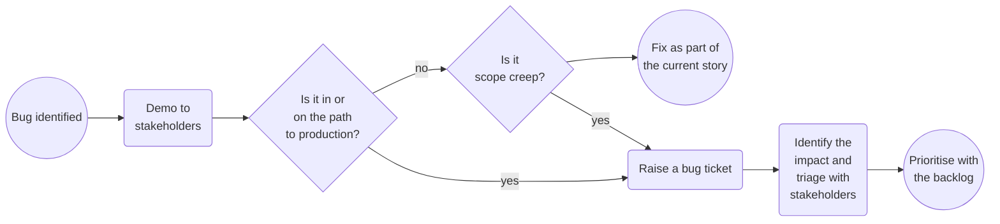
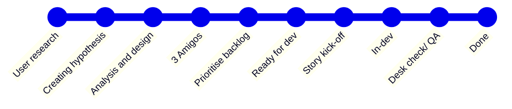

It is important that everyone in the team has a shared understanding of how they work together, however having the right level of documentation is tricky, especially around ways of working. Not enough will cause team members to not understand principles, boundaries or constraints which could impact mental health, and too much will overload team members, running the risk of key pieces of information being overlooked. Finding a balance is important and is an ongoing task and requires continual care.

<!--more-->

Over time a project and a team's ways of working will evolve, having an up to date set of documents on the team's ways of working will maintain alignment even when the team shape inevitably changes. These should be living documents, we should be open to criticism and challenge, refining our documentation and processes.

Starting a new project can be a daunting task. The goal of this article is to provide a sensible starting point to align your team(s), outlining ceremonies that I find useful and documents that I would expect to see. I am clearly a fan of documentation, however I try to keep important documents lean. I want the team to be able to digest them quickly and be easy to refer back to.

## Ceremonies

### Standup

Stand-ups should be short, time-boxed meetings allowing team members to give an update on their work in progress. Stand-ups help team members keep each other accountable and support each other in the work the team has signed up to deliver. I default to a daily morning standup and expect all team members to join, I also find opening these up to other stakeholders as observers beneficial.

There are many ways to run a standup, I have a strong preference that I find keeps focus on what we find valuable (What is on the board) and allows everyone's voice to be heard. A rotating facilitator gives everyone the opportunity to practise facilitation in a safe environment for a short period of time, it breaks down barriers and builds rapport. I also find walking-the-board keeps focus on the stories and not a dull rendition of someone's day.

walking-the-board: Go through each work item on the team board. Whoever is working on
That item provides the latest progress update. Start with the work items on the right since they are closer to done.

If there are more detailed discussions required, they should be noted for an offline
discussion. A huddle straight after stand-up is a good time for this.

### Analysis

Larger group analysis sessions, commonly referred to as refinement, have the goal to move stories from 'in analysis' to 'ready for dev', meeting our definition-of-ready requirements. These sessions tend to involve the entire team, going through the backlog of stories that do not currently meet our definition-of-ready with the goal to reach a shared understanding. Developer time is precious, I find I get the most out of these larger group sessions if a well written story is presented to give everyone the opportunity to raise concerns and for us to estimate. To get to this point requires work, running smaller analysis sessions will help to get a story in a good state before presenting to the wider group.

#### 3 Amigos

### Kickoff

I try to keep kickoffs short. By this point everyone should have some understanding of the ask. A run through of the story, acceptance criteria and approach. A quick check to see if we are still all aligned and an opportunity to ask more clarifying questions. If we are not aligned it is less risky to move the story back to analysis and pick up something different. If kickoffs regularly go over 10 minutes it is worth taking a step back and asking yourself "How can I make my analysis sessions more effective?"

### Desk check

A desk check gives a developer the opportunity to demo the story to stakeholders, including QA's, analysts, product owners. This keeps the feedback loop short and gives stakeholders the opportunity to ask questions or request changes. These also serve as a powerful marker to check the quality of our stories, if we are regularly seeing stories fail desk checks we may want to review our analysis and story writing approach.

### Showcase

Showcases are designed to gather feedback from those who are directly or indirectly  affected by the team’s work and those accountable for the work of the team. The team also receives validation for the work delivered and direction on how to move forward with the work.

Showcases provide the team exposure to stakeholders and give an opportunity for the team to practise presentation skills in a safe environment. I believe the showcase should be a celebration, the team has worked hard on creating value and delivering stories. My preference is a light user focused session, rich in demos, keeping code to an absolute minimum, no longer than an hour.

Picking your cadence is important, too frequent and you'll struggle to keep the audience engaged, too long and you'll have invested lots of time without receiving feedback, reducing the ability to course correct. I find every 2 weeks works well.

## Definitions

### Definition of Ready

Getting halfway through a story only to find key pieces of information are missing or have not been signed off by the organisation is frustrating. It slows down the team and hurts morale. Knowing when a story is ready for development is incredibly important. A short and simple tick list to move a story from analysis to ready for dev should ensure we only work on what is most important and ready for development.

* Follows the story/ bug/ spike template
* Refined with BA
* Estimated
* Prioritised
* Not blocked/ No dependencies

### Definition of Done

Without a clear definition of done, how do we know the feature or story is complete? Our definition of done relies heavily on well written clear stories. Depending on your path to production and QA process this can vary. Unless otherwise stated the following should be completed before we can say the story is complete.

* All acceptance criteria completed
* All acceptance criteria covered by automated tests
* All acceptance criteria tested by someone who did not develop the story
* Desk checked with story stakeholders
* Ready for showcase
* Deployed to production
* Feature toggle enabled
* Appropriate documentation

## Templates

### The board

Columns and swim lanes often trigger rich debate within teams. It is common for team members to have strong opinions on the balance between a useful board that provides visibility and metrics and a terrible board that doesn't show enough or requires lots of maintenance. 

If I had to lean in one direction it would be towards the more simple boards. I aim to work in cross functional, small teams- [Amazon's two pizza rule works well](https://docs.aws.amazon.com/whitepapers/latest/introduction-devops-aws/two-pizza-teams.html), this means I get little benefit out of swimlanes. I also want to encourage ownership of a story. I am for a single dev to anchor a story and see it from kickoff all the way to done. This reduces the value in having many granular columns, it becomes an overhead or even worse becomes something we measure that has a high chance of being inaccurate as the columns are not gates or handover points.

| Column     | Gate condition |
| ----------- | ----------- |
| `In analysis` | Does the organisation want this feature? |
| `Ready for dev` | Does it meet our definition of ready? |
| `In dev` | Does it meet our definition of done? |
| `Done` | |

If you start to see a slow down in velocity you might want to consider adding in columns to reflect handover points, for example `In QA`. This can help to narrow down issues and validate our thoughts before making more radical changes to our ways of working.

### Story

The story should encompass all information needed. Aiming for thin vertical sliced stories that can deliver value into the users hands, allowing us to get feedback quickly. Following [Bill Wake’s INVEST principles](https://xp123.com/articles/invest-in-good-stories-and-smart-tasks/); every story should be.

* I – Independent
* N – Negotiable
* V – Valuable
* E – Estimable
* S – Small
* T – Testable

There is no perfect way to write stories, over time your story template will evolve and what is valuable to your team should take focus. I find the following template a good starter.

| Item     | Description |
| ----------- | ----------- |
| `As a [Persona]` | Who are we building it for? |
| `I want [Functionality]` | How do we know when its done? |
| `So that [Goal]` | Why are we building it? |
| List of acceptance criteria | How do we know when its done? |

#### Acceptance criteria

I tend to prefer easily answerable questions over `Given.., When…, Then` syntax, however both work well. I also find that being explicit in which cross functional requirements we should watch out for helps guide conversation during analysis and identify possible pitfalls before development has started.

### Spike

We often have a need to introduce a new technology, tool or service. Unknowns impact estimation, planning and prioritisation. We can mitigate uncertainty by running timeboxed spikes. Tech spikes give the team dedicated time to explore without being confined to production code constraints.

You may want to run a tech spike when

* New technology is being introduced to the team
* Multiple solutions are proposed without an obvious choice
* Teams are struggling to estimate or breakdown large stories
* Confidence in proposed solution is low

If code is produced as part of the spike it is used to enhance our understanding or to share knowledge, it is not production code.

I try to keep the spikes focused on a particular problem, they are not standalone products or proof of concepts.

The output of the spike is important, the team should share the same understanding of the dev or pair that ran the spike. Documenting our findings and feeding back should be part of our definition of done. If the scope of the spike was to explore an architectural style we should write up our findings as an architecture decision record (ADR), this applies even when the output of our spike confirms we will not be going in a particular direction.

I keep the structure of spikes pretty simple and timebox them by the half day increments up to a week.

| Item     | Description |
| ----------- | ----------- |
| `Challenge` | What are we trying to answer? |
| `Findings` | What have we found? |
| `Recommendations` | What should we do next? |

### Bug

Bugs happen. As a principle I aim to fix forward; cherry picking commits can become tricky and rolling back might have unintended consequences, particularly with our evolving infrastructure. It is important to identify where the bug is, and the impact it has. We also do not want to maintain a large bug backlog as the maintenance of it becomes a massive overhead. With that in mind any bug found (that is not an urgent fix) should be prioritised along the rest of the backlog, and changed to an enhancement feature if required.

A sensible default flow for handling bugs is:

| Item     | Description |
| ----------- | ----------- |
| `Steps to Reproduce` | Enough information to find the bug |
| `Current behaviour` | Screenshots and console logs will help |
| `Expected behaviour` | Links to previous stories will add clarity |

### Task/ Tech Task

I try to stay away from `Tasks`, especially `Tech Tasks`. I believe this takes the focus away from users, without having a user to focus on we cannot determine the value the change will bring. Having a persona can sometimes take more thought, but this is time well spent, it helps us analyse why this is valuable, aids prioritisation, helps with communication with non technical stakeholders and, opens discussion to different approaches before jumping into implementation details. Not all personas will be typical users of the product, we might see anti-personas or bad actors to drive out security requirements or team members when we are looking to make improvements with developer experience.

## Story lifecycle

Having a shared understanding of handover points and gates will ensure that stories are not left behind and we all know how to keep them moving across the boards.

